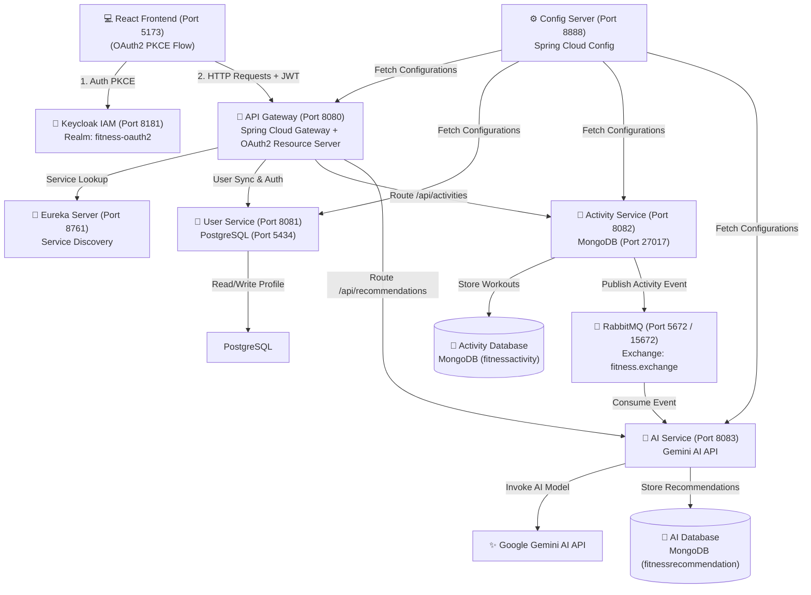

# 🏋️ FitnessPulse AI - Microservices Fitness Tracker & AI Recommendation Engine

A full-stack, event-driven microservices fitness tracking platform built with **Spring Boot 3**, **Spring Cloud Gateway**, **Keycloak (OAuth2 PKCE)**, **RabbitMQ**, **MongoDB**, **PostgreSQL**, and **React (Vite + Material UI)** integrated with **Google Gemini AI**.

---

## 🏗️ System Architecture



---

## 🚀 Microservices Overview

| Microservice / Service | Port | Description | Database / Store |
| :--- | :--- | :--- | :--- |
| **Config Server** | `8888` | Centralized YAML configuration management | Local File System / Git |
| **Eureka Server** | `8761` | Service discovery and registration registry | In-Memory Registry |
| **API Gateway** | `8080` | Entry point, JWT OAuth2 validation, dynamic user sync filter, CORS handling | - |
| **User Service** | `8081` | Manages user profiles and authentication verification | PostgreSQL (`fitness_user_db` port `5434`) |
| **Activity Service** | `8082` | Logs workouts, retrieves activity stats, publishes events to RabbitMQ | MongoDB (`fitnessactivity` port `27017`) |
| **AI Service** | `8083` | Consumes RabbitMQ workout events, calls Gemini AI to generate insights | MongoDB (`fitnessrecommendation` port `27017`) |
| **Keycloak IAM** | `8181` | Identity & Access Management with OpenID Connect PKCE flow | Keycloak Internal H2 / DB |
| **RabbitMQ** | `5672` / `15672` | Message broker for asynchronous event-driven processing | Queue: `activity.queue` |
| **React Frontend** | `5173` | Interactive Vite + MUI dashboard with stats and AI feedback | - |

---

## ✨ Features

- **🔐 Centralized Authentication**: Secured via Keycloak 24 OAuth2 PKCE flow with roles (`ROLE_USER`, `ROLE_ADMIN`).
- **🔄 Automated User Sync**: Gateway filter extracts JWT sub claims and auto-synchronizes user accounts to PostgreSQL via `User Service`.
- **📊 Activity Tracking**: Log workouts including Running, Walking, Cycling, Swimming, Weight Training, and Yoga with duration, calories burned, and custom metrics.
- **⚡ Event-Driven AI Insights**: Asynchronous RabbitMQ architecture passes completed workouts to `AI Service` which queries **Google Gemini AI** to produce personalized recovery tips and fitness feedback.
- **🎨 Modern Responsive UI**: Dashboard featuring stats summaries (Total Workouts, Calories Burned, Active Time), filterable cards, and AI detail modal built with React 19 and Material UI 6.

---

## 🛠️ Prerequisites

- **Java JDK**: 17+ (Java 21/25 compatible)
- **Maven**: 3.8+
- **Node.js**: 18+ & npm
- **Docker & Docker Compose**

---

## ⚡ Quick Start Guide

### 1. Start Infrastructure Containers (PostgreSQL, MongoDB, RabbitMQ, Keycloak)

Run Docker Compose to spin up all required backend infrastructure services:

```bash
docker-compose up -d
```

Verify container status:
```bash
docker ps
```

* **Keycloak Admin**: `http://localhost:8181/admin` (`admin` / `admin`)
* **RabbitMQ Management**: `http://localhost:15672` (`guest` / `guest`)
* **PostgreSQL Port**: `5434` (Database: `fitness_user_db`, User: `postgres`, Password: `admin@123`)

---

### 2. Configure Keycloak Realm & Users

1. Access `http://localhost:8181/admin` and log in with credentials `admin` / `admin`.
2. Create Realm: **`fitness-oauth2`**.
3. Create Client: **`oauth2-pkce-client`**:
   - Standard Flow & Direct Access Grants Enabled.
   - Valid Redirect URIs: `http://localhost:5173/*`
   - Web Origins: `http://localhost:5173` and `*`
4. Create Roles: `ROLE_USER` and `ROLE_ADMIN`.
5. Create Test Users:
   - **Admin**: `admin` / `admin` (Assign `ROLE_ADMIN`)
   - **Test User**: `testuser` / `password123` (Assign `ROLE_USER`)

---

### 3. Build & Run Backend Microservices

Launch services in order:

```bash
# 1. Config Server
cd configserver
mvn spring-boot:run

# 2. Eureka Server (in new terminal)
cd eureka
mvn spring-boot:run

# 3. User Service (in new terminal)
cd userservice
mvn spring-boot:run

# 4. Activity Service (in new terminal)
cd activityservice
mvn spring-boot:run

# 5. AI Service (in new terminal)
cd aiservice
mvn spring-boot:run

# 6. API Gateway (in new terminal)
cd gateway
mvn spring-boot:run
```

Check Eureka Dashboard at `http://localhost:8761` to confirm all 4 microservices (`API-GATEWAY`, `USER-SERVICE`, `ACTIVITY-SERVICE`, `AI-SERVICE`) show status **UP**.

---

### 4. Start React Frontend

```bash
cd fitness-app-frontend
npm install
npm run dev
```

Open `http://localhost:5173` in your browser. Click **Log In** to authenticate via Keycloak!

---

## 📡 API Endpoint Reference (via Gateway Port 8080)

All endpoints are proxied through the API Gateway at `http://localhost:8080/api`:

### 🏃 Activity Service (`/api/activities`)
- `GET /api/activities` - Fetch activities for the authenticated user (`X-User-ID` header required)
- `POST /api/activities` - Log a new activity (Publishes event to RabbitMQ)
- `GET /api/activities/{id}` - Fetch single activity by ID

### 👤 User Service (`/api/users`)
- `GET /api/users/{userId}` - Get user profile
- `POST /api/users/register` - Register new user profile
- `GET /api/users/{userId}/validate` - Check if user exists in PostgreSQL

### 🤖 AI Service (`/api/recommendations`)
- `GET /api/recommendations/activity/{activityId}` - Get AI recommendation for a specific activity
- `GET /api/recommendations/user/{userId}` - Get user recommendations history

---

## 🔑 Environment Variables

To customize the Gemini AI Key or endpoints, update environment variables or `configserver/src/main/resources/config/ai-service.yml`:

```yaml
gemini:
  api:
    url: ${GEMINI_API_URL:https://generativelanguage.googleapis.com/v1beta/models/gemini-2.0-flash:generateContent?key=}
    key: ${GEMINI_API_KEY:YOUR_GEMINI_API_KEY}

```

---

## 📄 License

Distributed under the MIT License.
